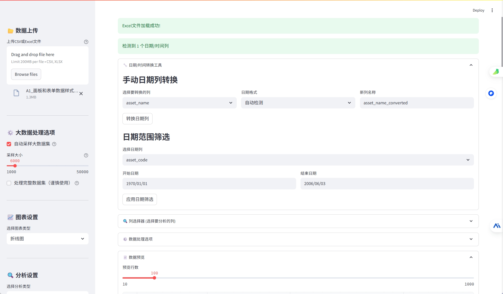
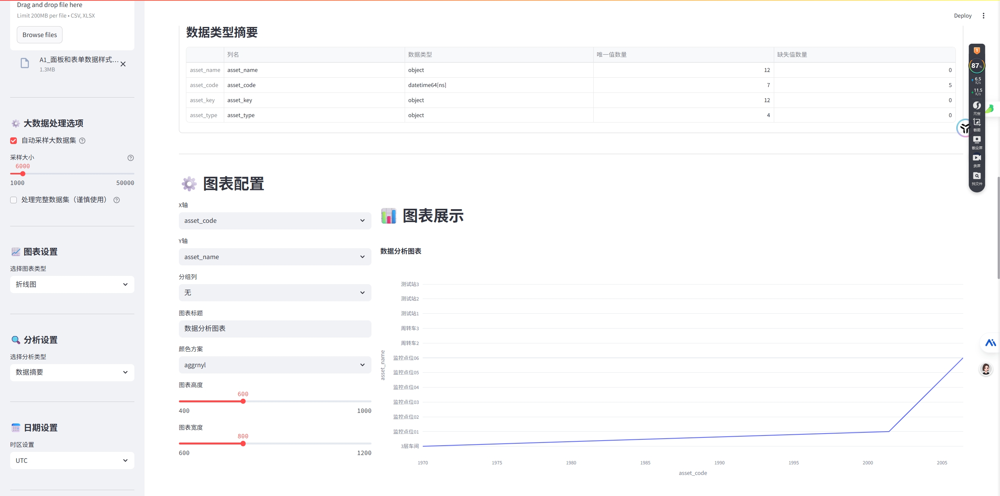

# script-toolbox
Script Toolbox

## 脚本工具箱

### Git 提交历史邮箱更新脚本 (update_git_history_email.sh)

这个脚本用于批量修改 Git 仓库中的提交历史中的邮箱地址。当您需要更新 Git 提交历史中的邮箱信息时，这个工具可以帮助您快速完成操作。

#### 使用方法

1. 编辑脚本中的以下变量：
   ```bash
   OLD_EMAIL="test@demo.com"      # 要替换的旧邮箱
   NEW_EMAIL="newtest@demo.com"   # 新的邮箱地址
   CORRECT_NAME="test"            # 要修改的提交者名称
   CORRECT_EMAIL="newtest@demo.com" # 要修改的提交者邮箱
   ```

2. 在 Git 仓库根目录下运行脚本：
   ```bash
   chmod +x update_git_history_email.sh
   ./update_git_history_email.sh
   ```

#### 注意事项

- **重要**：执行脚本前请务必备份您的仓库，因为这是一个不可逆的操作
- 脚本执行完成后，需要使用 `git push --force --tags origin 'refs/heads/*'` 强制推送到远程仓库
- 如果是 GitHub 保护分支，可能需要临时解除保护才能强制推送
- 此操作会改变所有提交的 SHA-1 值，如果是团队协作项目，请确保通知所有相关成员

#### 使用场景

- 更改错误的提交邮箱地址
- 统一团队成员的提交邮箱格式
- 更新个人或组织的邮箱信息

## 数据分析可视化工具 (data_analysis.py)

### 示例使用

以下是一个简单的使用示例：

1. 上传一个包含日期和数值列的 CSV 文件。
2. 选择折线图作为图表类型。
3. 配置日期列为 X 轴，数值列为 Y 轴。
4. 调整图表样式后，点击生成图表。

您可以参考以下截图以了解工具界面和生成的图表效果：



这是一个基于 Streamlit 的交互式数据分析和可视化工具，支持大规模数据集处理、多种图表类型和高级分析功能。

### 主要功能

1. 数据导入
   - 支持 CSV 和 Excel 文件导入
   - 自动处理大型数据集（自动采样）
   - 内置示例数据生成器

2. 日期/时间处理
   - 自动检测和转换多种日期格式
   - 支持时间序列分析
   - 灵活的时区设置

3. 可视化图表
   - 折线图、柱状图、散点图
   - 饼图、箱线图、热力图
   - 面积图、直方图
   - 时间序列图表

4. 数据分析
   - 数据摘要统计
   - 相关性分析
   - 时间序列分析
   - 分类数据分析

5. 数据导出
   - 支持导出图表（PNG/SVG/PDF）
   - 支持导出数据（CSV/Excel）

### 安装依赖

```bash
pip install streamlit pandas numpy matplotlib seaborn plotly openpyxl xlsxwriter
```

### 运行方法

```bash
streamlit run data_analysis.py
```

### 使用说明

1. 数据上传
   - 通过文件上传器选择数据文件
   - 或使用生成示例数据功能

2. 图表配置
   - 选择图表类型
   - 配置坐标轴和分组选项
   - 调整图表样式和大小

3. 数据分析
   - 选择分析类型
   - 查看统计摘要
   - 探索数据关系

4. 结果导出
   - 导出图表为多种格式
   - 导出分析数据

### 注意事项

- 对于大型数据集，工具会自动采样以提高性能
- 时间序列分析需要有效的日期/时间列
- 部分分析功能可能需要纯数值数据
- 建议在导出大量数据前先预览结果

### 系统要求

- Python 3.7+
- 足够的内存处理目标数据集
- 现代网页浏览器